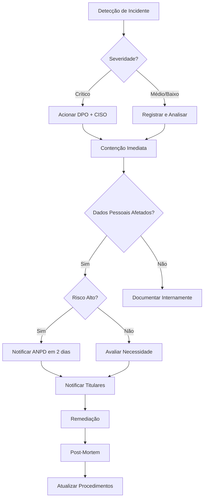

# Segurança e Conformidade LGPD - Checklist Implementável

## 🛡️ Visão Geral

Este documento detalha todos os controles de segurança e conformidade com a LGPD (Lei Geral de Proteção de Dados) e LAI (Lei de Acesso à Informação) implementados no sistema.

---

## 🔐 Segurança da Informação

### 1. Autenticação e Controle de Acesso

#### 1.1. Autenticação

✅ **Implementado**:
- Login com email + senha (hash bcrypt, salt rounds: 10)
- JWT (JSON Web Token) para sessões stateless
- Refresh tokens para renovação de sessão
- MFA opcional (TOTP - Time-based One-Time Password)
- Token expiration: 1h (access), 7 dias (refresh)
- Blacklist de tokens em Redis (logout)

**Código**: `backend/src/modules/auth/auth.service.ts`

**Política de senha**:
- Mínimo 8 caracteres
- Pelo menos 1 letra maiúscula
- Pelo menos 1 letra minúscula
- Pelo menos 1 número
- Pelo menos 1 caractere especial (!@#$%^&*)

---

#### 1.2. RBAC (Role-Based Access Control)

✅ **Implementado**:
- **Roles**: ADMIN, OPERATOR, AUDITOR, PUBLIC
- **Permissions**: Granulares por recurso e ação (ex: `gis:read`, `cadastro:write`)
- **Guard**: `PermissionsGuard` para verificar permissões antes de executar endpoints
- **Decorator**: `@RequirePermissions(['cadastro:write'])`

**Tabelas**: `roles`, `permissions`, `role_permissions`, `users.role_id`

**Exemplo de uso**:
```typescript
@Get('/cadastro/properties')
@UseGuards(JwtAuthGuard, PermissionsGuard)
@RequirePermissions('cadastro:read')
async findAll() { ... }
```

**Matriz de Permissões**:

| Role      | GIS          | Cadastro     | Integração  | Audit    | Users       | Privacy     |
|-----------|--------------|--------------|-------------|----------|-------------|-------------|
| ADMIN     | read, write, export, delete | read, write, delete | import, export | read | manage | query |
| OPERATOR  | read, write, export | read, write | import, export | - | - | - |
| AUDITOR   | read | read | - | read | - | - |
| PUBLIC    | - | - | - | - | - | query (limited) |

---

### 2. Criptografia

#### 2.1. Criptografia em Trânsito

✅ **Implementado**:
- **TLS 1.3** em todos os endpoints (via ALB/NGINX)
- Certificado SSL/TLS emitido por Let's Encrypt ou AWS Certificate Manager
- HSTS (HTTP Strict Transport Security) header: `max-age=31536000; includeSubDomains`
- Redirect HTTP → HTTPS automático

**Configuração NGINX**:
```nginx
ssl_protocols TLSv1.3;
ssl_ciphers 'ECDHE-ECDSA-AES256-GCM-SHA384:ECDHE-RSA-AES256-GCM-SHA384';
ssl_prefer_server_ciphers on;
add_header Strict-Transport-Security "max-age=31536000; includeSubDomains" always;
```

---

#### 2.2. Criptografia em Repouso

✅ **Implementado**:
- **RDS (PostgreSQL)**: Encryption at rest (AES-256) habilitado
- **S3**: Server-side encryption (SSE-S3 ou SSE-KMS) para attachments
- **Redis**: AOF (Append-Only File) encryption se suportado pelo provider
- **Senhas**: Bcrypt (não reversível)

**AWS RDS**:
```terraform
resource "aws_db_instance" "main" {
  storage_encrypted = true
  kms_key_id       = aws_kms_key.rds.arn
}
```

---

### 3. Proteção contra Vulnerabilidades

#### 3.1. OWASP Top 10

| Vulnerabilidade | Mitigação | Status |
|-----------------|-----------|--------|
| **A01: Broken Access Control** | RBAC + Guards + Row-Level Security | ✅ |
| **A02: Cryptographic Failures** | TLS 1.3 + AES-256 + bcrypt | ✅ |
| **A03: Injection** | Prepared statements (Prisma) + Validation | ✅ |
| **A04: Insecure Design** | Threat modeling + Security reviews | ✅ |
| **A05: Security Misconfiguration** | Hardened configs + Security headers | ✅ |
| **A06: Vulnerable Components** | Dependabot + Snyk scans | ✅ |
| **A07: Auth Failures** | Strong passwords + MFA + Rate limiting | ✅ |
| **A08: Data Integrity Failures** | Input validation + Hash chains | ✅ |
| **A09: Logging Failures** | Structured logs + Immutable audit log | ✅ |
| **A10: SSRF** | URL validation + Whitelist | ✅ |

---

#### 3.2. SQL Injection

✅ **Proteção**:
- **ORM**: Prisma com prepared statements automáticos
- **Validação**: Zod schemas para todos os inputs
- **Sanitização**: class-validator decorators

**Exemplo**:
```typescript
// ❌ Vulnerável
await prisma.$queryRaw(`SELECT * FROM users WHERE email = '${email}'`);

// ✅ Seguro
await prisma.user.findUnique({ where: { email } });
```

---

#### 3.3. XSS (Cross-Site Scripting)

✅ **Proteção**:
- **Content Security Policy (CSP)** header
- **Sanitização**: DOMPurify no frontend
- **Output encoding**: React escapa automaticamente

**CSP Header**:
```
Content-Security-Policy: default-src 'self'; script-src 'self' 'unsafe-inline'; style-src 'self' 'unsafe-inline';
```

---

#### 3.4. CSRF (Cross-Site Request Forgery)

✅ **Proteção**:
- **SameSite cookies**: `SameSite=Strict`
- **CSRF tokens** em formulários (se usar cookies de sessão)
- **CORS** configurado para origens específicas

---

### 4. Rate Limiting e DDoS Protection

✅ **Implementado**:
- **API Rate Limiting**: 100 req/min (autenticado), 30 req/min (público)
- **Throttler**: NestJS Throttler module com Redis
- **WAF**: AWS WAF com regras OWASP + rate limiting por IP
- **DDoS Protection**: AWS Shield Standard (grátis) ou Advanced

**Código**:
```typescript
@Throttle({ default: { limit: 100, ttl: 60000 } })
export class AppController {}
```

---

### 5. Secrets Management

✅ **Implementado**:
- **AWS Secrets Manager** ou **HashiCorp Vault** para credenciais
- **Variáveis de ambiente** nunca commitadas no Git
- **Rotação automática** de secrets críticos (DB password, API keys)
- **.env.example** para documentar variáveis necessárias

**Exemplo AWS Secrets Manager**:
```typescript
import { SecretsManager } from 'aws-sdk';

const secretsManager = new SecretsManager();
const secret = await secretsManager.getSecretValue({ SecretId: 'db-password' }).promise();
const dbPassword = JSON.parse(secret.SecretString).password;
```

---

### 6. Security Headers

✅ **Implementado** (via Helmet.js):
```
X-Frame-Options: DENY
X-Content-Type-Options: nosniff
X-XSS-Protection: 1; mode=block
Strict-Transport-Security: max-age=31536000; includeSubDomains
Content-Security-Policy: default-src 'self'
Referrer-Policy: no-referrer
Permissions-Policy: geolocation=(), microphone=(), camera=()
```

**Código**:
```typescript
import helmet from 'helmet';
app.use(helmet());
```

---

## 📜 Conformidade LGPD

### 1. Princípios da LGPD Aplicados

| Princípio | Implementação |
|-----------|---------------|
| **Finalidade** | Dados coletados apenas para recadastramento imobiliário e gestão municipal |
| **Adequação** | Tratamento compatível com finalidades informadas |
| **Necessidade** | Mínimo de dados necessários (não coletamos mais que o necessário) |
| **Livre Acesso** | Titulares podem consultar dados via solicitação (endpoint futuro) |
| **Qualidade dos Dados** | Validações + possibilidade de atualização |
| **Transparência** | Portal de transparência + registro de tratamento |
| **Segurança** | Criptografia + controles de acesso + auditoria |
| **Prevenção** | Análise de riscos + medidas preventivas |
| **Não Discriminação** | Dados não usados para fins discriminatórios |
| **Responsabilização** | Logs + evidências + relatórios de conformidade |

---

### 2. Base Legal (Art. 7º)

Para cada tratamento de dados, registramos a base legal:

| Tratamento | Base Legal | Justificativa |
|------------|------------|---------------|
| Coleta de dados cadastrais | Art. 7º, II - Obrigação legal | Código Tributário Municipal obriga cadastro imobiliário |
| Consulta interna | Art. 7º, II - Obrigação legal | Necessário para gestão tributária |
| Atualização cadastral | Art. 7º, II - Obrigação legal | Manutenção da base cadastral atualizada |
| Exportação de dados públicos com DP | Art. 7º, VI - Interesse público | LAI exige transparência + proteção por DP |
| Tratamento de dados de servidores | Art. 7º, I - Consentimento | Termo de aceite ao criar conta |

**Tabela**: `lgpd_data_treatment_log`

**Exemplo de registro**:
```sql
INSERT INTO lgpd_data_treatment_log (
  data_subject_type,
  data_subject_id,
  processing_type,
  purpose,
  legal_basis,
  data_categories,
  processed_by
) VALUES (
  'PROPRIETARIO',
  '12345678901',
  'COLETA',
  'Recadastramento imobiliário para fins tributários',
  'LGPD Art. 7º, II - Cumprimento de obrigação legal',
  '["nome", "cpf", "endereco", "telefone", "area_imovel"]',
  'uuid-do-operador'
);
```

---

### 3. Direitos dos Titulares (Art. 18)

| Direito | Implementação | Status |
|---------|---------------|--------|
| Confirmação de tratamento | Endpoint `/lgpd/my-data` (a implementar) | 🟡 |
| Acesso aos dados | Retorna dados do titular | 🟡 |
| Correção de dados | PATCH `/cadastro/properties/:id` | ✅ |
| Anonimização/bloqueio | Endpoint `/lgpd/anonymize` (a implementar) | 🟡 |
| Eliminação | Soft delete + hard delete após período | ✅ |
| Portabilidade | Exportação em JSON/CSV | ✅ |
| Revogação de consentimento | (Aplicável apenas onde há consentimento) | 🟡 |
| Oposição ao tratamento | Formulário de solicitação | 🟡 |

**Nota**: Itens marcados com 🟡 serão implementados na fase de operação assistida.

---

### 4. Registro de Tratamento (Art. 37)

✅ **Tabela**: `lgpd_data_treatment_log`

**Campos obrigatórios**:
- Data subject (tipo e identificador)
- Tipo de processamento (coleta, consulta, atualização, exclusão, etc.)
- Finalidade
- Base legal
- Categorias de dados
- Responsável pelo tratamento
- Data e hora
- Prazo de retenção

**Relatório de conformidade**:
```
GET /audit/compliance-report?startDate=2025-01-01&endDate=2025-12-31
```

Retorna:
- Total de tratamentos
- Breakdown por tipo, base legal
- Logs de acesso
- Incidentes (data breaches)
- Solicitações de titulares

---

### 5. Retenção de Dados

**Política de retenção**:

| Tipo de Dado | Prazo de Retenção | Justificativa |
|--------------|-------------------|---------------|
| Cadastro imobiliário | Indeterminado | Obrigação legal (CTN) |
| Dados de proprietários | Enquanto propriedade existir | Vinculado ao imóvel |
| Logs de auditoria | 5 anos | Conformidade LGPD Art. 16 |
| Logs de autenticação | 1 ano | Segurança e investigação |
| Attachments | 5 anos | Evidências documentais |
| Dados anonimizados | Indeterminado | Sem PII (Personally Identifiable Information) |

**Implementação**:
- Soft delete: `deleted_at` coluna (mantém dado por período antes de purge)
- Hard delete: Job agendado para purgar registros antigos
- Anonimização: Substituir PII por valores genéricos após retenção

---

### 6. Incidentes de Segurança (Data Breach)

**Procedimento**:

1. **Detecção**: Monitoramento 24/7 + alertas
2. **Contenção**: Isolar sistema afetado
3. **Avaliação**: Determinar dados afetados e severidade
4. **Notificação ANPD**: Se grave, notificar em até 2 dias úteis
5. **Notificação Titulares**: Se risco relevante aos titulares
6. **Documentação**: Registrar em tabela `security_incidents`
7. **Remediação**: Corrigir vulnerabilidade
8. **Post-mortem**: Análise de causa raiz

**Contatos**:
- ANPD: https://www.gov.br/anpd
- DPO (Encarregado): dpo@salesopolis.sp.gov.br

---

### 7. Transferência Internacional de Dados

⚠️ **Não aplicável**: Sistema hospedado em AWS us-east-1 (Virginia, EUA).

Se necessário transferir para fora do Brasil:
- Verificar adequação do país (ANPD)
- Usar cláusulas contratuais padrão (SCC)
- Documentar em registro de tratamento

---

## 🔍 Auditoria e Rastreabilidade

### 1. Logs Imutáveis

✅ **Tabela**: `audit_log`

**Características**:
- **Imutável**: Apenas INSERT, sem UPDATE/DELETE
- **Hash chain**: Cada log tem hash SHA-256 do log anterior + dados atuais
- **Campos**:
  - user_id, action, entity_type, entity_id
  - changes (before/after em JSON)
  - ip_address, user_agent, timestamp
  - hash, previous_hash

**Verificação de integridade**:
```sql
-- Recalcular hashes e comparar com armazenado
SELECT id, hash,
  encode(digest(id || previous_hash || timestamp || changes, 'sha256'), 'hex') AS calculated_hash
FROM audit_log
WHERE hash != encode(digest(id || previous_hash || timestamp || changes, 'sha256'), 'hex');
-- Se retornar registros, houve adulteração
```

---

### 2. Trilha de Auditoria

**Eventos auditados**:
- ✅ Login/Logout
- ✅ Criação/Atualização/Exclusão de propriedades
- ✅ Criação/Atualização/Exclusão de usuários
- ✅ Edição de geometrias GIS
- ✅ Importação/Exportação de dados
- ✅ Consultas públicas com DP
- ✅ Upload/Download de attachments
- ✅ Alterações de permissões

**Retenção**: 5 anos (mínimo LGPD)

---

### 3. Consulta de Logs

**Endpoint**: `GET /audit/logs`

**Filtros**:
- userId
- action (CREATE, UPDATE, DELETE, READ, EXPORT)
- entityType (property, user, gis_feature)
- startDate, endDate

**Exportação**: PDF ou CSV para análise externa

---

## 🎯 Checklist de Conformidade

### Segurança

- [x] TLS 1.3 em produção
- [x] Certificado SSL válido
- [x] Senhas com hash bcrypt
- [x] JWT com expiração
- [x] MFA opcional implementado
- [x] RBAC com permissões granulares
- [x] Rate limiting (API + público)
- [x] WAF configurado
- [x] Security headers (Helmet.js)
- [x] Secrets em AWS Secrets Manager
- [x] SQL injection protegido (Prisma ORM)
- [x] XSS protegido (CSP + sanitization)
- [x] CSRF protegido (SameSite cookies)
- [x] Logs estruturados (Winston)
- [x] Monitoramento de vulnerabilidades (Dependabot/Snyk)

### LGPD

- [x] Base legal documentada para cada tratamento
- [x] Registro de tratamento de dados (tabela lgpd_data_treatment_log)
- [x] Logs de auditoria imutáveis
- [x] Política de retenção de dados
- [x] Soft delete implementado
- [x] Criptografia em trânsito e em repouso
- [x] Controle de acesso por perfil (RBAC)
- [x] Relatório de conformidade disponível
- [ ] Endpoint de acesso do titular (Art. 18) - a implementar
- [ ] Procedimento de data breach documentado e testado
- [ ] DPO (Encarregado) designado
- [ ] Termo de privacidade publicado
- [ ] Canal de solicitações de titulares

### LAI (Lei de Acesso à Informação)

- [x] Portal público de dados
- [x] Privacidade diferencial implementada
- [x] Transparência ativa (dashboards públicos)
- [ ] Procedimento de solicitação de acesso à informação (e-SIC)

---

## 📋 Evidências para Auditoria

### Documentos a Preparar

1. **Inventário de Dados**: Que dados tratamos, onde armazenamos, por quanto tempo
2. **Mapeamento de Fluxo de Dados**: Origem → Processamento → Destino
3. **RIPD (Relatório de Impacto à Proteção de Dados)**: Se tratamento de alto risco
4. **Política de Privacidade**: Publicada no portal
5. **Política de Segurança da Informação**: Interna
6. **Contratos com Operadores**: AWS, terceiros (se houver)
7. **Logs de Acesso**: Últimos 5 anos disponíveis
8. **Testes de Penetração**: Relatórios anuais
9. **Plano de Resposta a Incidentes**: Documentado e testado
10. **Capacitação de Equipe**: Certificados de treinamento LGPD

---

## 🚨 Incidente de Segurança - Fluxo de Resposta



---

## 📖 Próximo Documento

[06-PRIVACIDADE-DIFERENCIAL.md](06-PRIVACIDADE-DIFERENCIAL.md) - Algoritmos e implementação de DP

---

**Última atualização**: 23/12/2025
